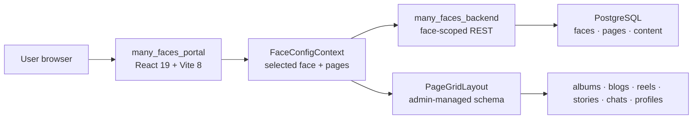
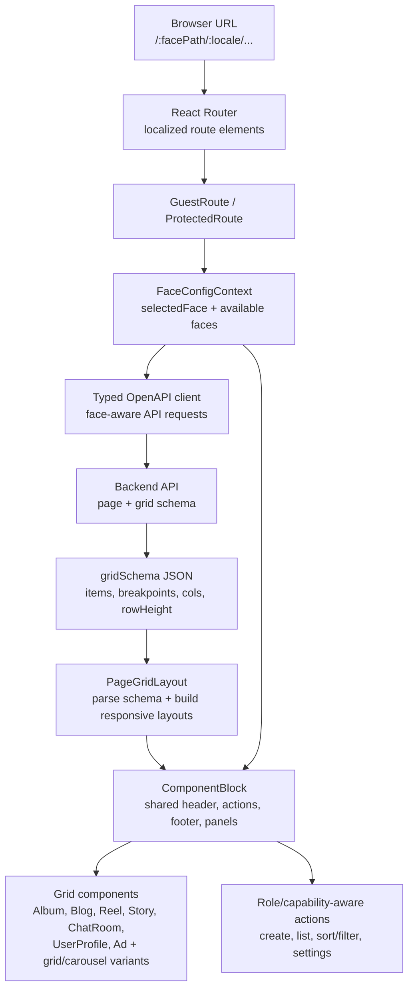
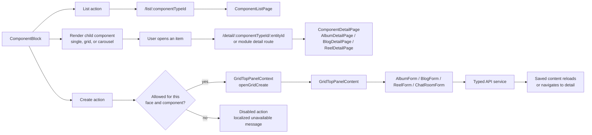
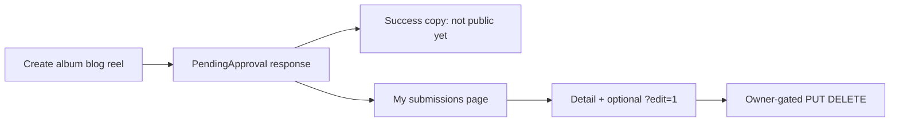

# Many Faces Portal

<!-- readme-badges:start -->

[](./VERSION)


[](https://github.com/01laky/many_faces_main/actions/workflows/ci.yml)


<!-- readme-badges:end -->

**Version:** [`1.0.5`](./VERSION) · [Changelog](./CHANGELOG.md)

**Author:** Ladislav Kostolny · [01laky@gmail.com](mailto:01laky@gmail.com)

> **User-facing web experience for Many Faces AI.** Renders face-scoped social spaces — dynamic page grids, localized routes, auth flows, media modules, stories, chat, profiles, and AI-powered content approval — all driven by admin-managed `gridSchema` JSON. Users never touch workers or AI directly.

---

## Quick Start

```bash
# Full stack — recommended
cd many_faces_main
./scripts/start-all-dev.sh

# Portal standalone
cd many_faces_portal
./scripts/start-dev.sh
```

**After starting:** Portal at `https://localhost:9081` · API at `https://localhost:8001`  
**Demo accounts:** [`docs/guides/local-dev-accounts.md`](../docs/guides/local-dev-accounts.md)

---

## Architecture



### Route and grid rendering

The frontend turns a face URL and backend-managed page schema into a responsive grid of reusable social components:



### Component interaction flow

Grid blocks share the same wrapper and route contract, keeping list/detail/create behaviour consistent across all content modules:



---

## Three Pillars

| Pillar               | Highlights                                                                                                                                                                                                                                                                                                    |
| -------------------- | ------------------------------------------------------------------------------------------------------------------------------------------------------------------------------------------------------------------------------------------------------------------------------------------------------------- |
| **Security (PSH1)**  | OAuth tokens in `localStorage`; single-flight refresh; production **`validateEnv()`** (HTTPS API, no demo OAuth secret); face-scoped routing; blog HTML sanitization; SignalR JWT via `accessTokenFactory`. CI: `node ../scripts/verify-portal-security-tests.mjs`. [`docs/SECURITY.md`](./docs/SECURITY.md). |
| **AI (user-facing)** | **AI-assisted content approval** — create album/blog/reel → **My submissions** shows moderation status (no raw model output). Backend runs `ReviewContent`; portal shows creator-safe copy only.                                                                                                              |
| **Configuration**    | `GET /api/faces/config` drives navigation, gradients, and page list; **face URL prefix** scopes all API calls; **capabilities** from `/api/me/capabilities` gate UI actions; i18n routes (en/sk/cs). Grid blocks: albums, blogs, reels, stories, chat, profiles, wall tickets.                                |

---

## What This App Delivers

| Capability                 | Details                                                                                                            |
| -------------------------- | ------------------------------------------------------------------------------------------------------------------ |
| **Face-aware routing**     | URL prefix scopes all API calls; face context drives navigation, gradients, and page list                          |
| **Dynamic page grids**     | Backend-managed `gridSchema` → responsive `PageGridLayout` + `ComponentBlock` rendering                            |
| **Social content modules** | Albums, blogs, reels, stories, wall tickets, chat rooms, profiles, follows, blocks, comments, likes, notifications |
| **Authentication flows**   | Registration, login, protected routes, JWT-backed API calls, single-flight token refresh                           |
| **My submissions hub**     | `/my-submissions` backed by `GET /api/my/content-submissions` — queue state, safe reasons, `?edit=1` deep links    |
| **Role/capability UI**     | Actions gated by `/api/me/capabilities`; unavailable features show localized messages                              |
| **Internationalization**   | Static UI copy from `GET /api/localization/portal`; CMS page slugs per-face; en/sk/cz                              |
| **Real-time**              | SignalR JWT via `accessTokenFactory`; chat rooms, live notifications                                               |
| **Generated API client**   | Auto-generated from backend OpenAPI spec; all calls fully typed                                                    |
| **Offline-safe states**    | Explicit empty, loading, and unavailable states — no reliance on external placeholders                             |

---

## Security (PSH1)

- OAuth tokens in `localStorage`; single-flight refresh on 401; logout clears auth + capabilities cache.
- Production builds: **`validateEnv()`** requires HTTPS `VITE_API_URL` and rejects demo OAuth secret (PSH1-E02).
- Face-scoped API routing; safe redirect and blog HTML sanitization; SignalR JWT via `accessTokenFactory`.
- Security Vitest: **`yarn test:security`**; monorepo CI: **`node scripts/verify-portal-security-tests.mjs`**.
- Cypress on production bundle: set non-demo **`VITE_OAUTH2_CLIENT_SECRET`** at build (CI does this automatically).

Full guide: [`docs/SECURITY.md`](./docs/SECURITY.md)

---

## AI-Powered Content Approval UX

Albums, blogs, and reels created from the frontend follow a moderation workflow. Create flows use the existing OpenAPI services, read backend-owned `approvalStatus` / `aiReviewStatus` fields, and show **submitted-for-approval** copy after a successful create.

**My submissions** loads the unified moderation list, groups rows by pipeline state (pending, AI in progress, needs human review, terminal outcomes), and links to detail pages with optional `?edit=1` when the backend allows owner edits.

Public grids stay `Approved`-only; the UI never shows internal AI diagnostics. Helpers in `src/utils/contentModeration.ts` map statuses to safe labels — covered by Vitest.



**Guide:** [`../docs/guides/ai-assisted-content-approval.md`](../docs/guides/ai-assisted-content-approval.md)

---

## Tech Stack

| Layer           | Technology                | Version |
| --------------- | ------------------------- | ------- |
| UI framework    | React                     | 19      |
| Build tool      | Vite                      | 8       |
| Language        | TypeScript                | strict  |
| Routing         | React Router              | v6      |
| Data fetching   | TanStack Query            | v5      |
| Styling         | Bootstrap                 | 5       |
| Package manager | Yarn                      | PnP     |
| Unit tests      | Vitest                    | —       |
| E2E tests       | Cypress                   | —       |
| API client      | Auto-generated (OpenAPI)  | —       |
| i18n            | i18next + backend `.resx` | —       |

---

## Project Structure

```
many_faces_portal/
├── src/
│   ├── api/                # Auto-generated OpenAPI client (services, models, core)
│   │   └── __tests__/      # Face path routing tests (23 tests)
│   ├── components/         # React components
│   │   └── radix/          # Custom Radix-based UI (Button, Input, FormField)
│   ├── pages/              # Page components (colocated per route)
│   ├── contexts/           # Auth, FaceConfig, GridTopPanel
│   ├── hooks/              # Custom React hooks
│   ├── i18n/               # i18n config and namespace loaders
│   ├── utils/              # contentModeration.ts, routeTranslations.ts, …
│   └── main.tsx            # Entry point
├── docs/                   # SECURITY.md, performance appendix, runtime-performance-v1.md
├── scripts/                # start/stop/clear/rebuild-dev.sh, lint, fix-editor
├── docker-compose.yml      # Standalone dev compose
├── Dockerfile.dev          # Dev image
└── Dockerfile              # Production image
```

---

## Face Path Routing

The frontend automatically scopes API requests to the active face based on the URL path.

### How it works

An Axios interceptor in `src/api/config.ts` automatically:

1. **Extracts the face path** from `window.location.pathname` (e.g., `/acme-corp/dashboard` → `acme-corp`)
2. **Handles language prefixes** correctly (`/en/login` → no face path; `/acme-corp/en/login` → `acme-corp`)
3. **Transforms API URLs** from `/api/users` to `/api/acme-corp/users`

```
# Language-only route (no face prefix)
/en/login           →  API: /api/users

# Face-prefixed route
/acme-corp/en/login →  API: /api/acme-corp/users
```

Coverage: **23 tests** in `src/api/__tests__/facePathRouting.test.ts`.

---

## Getting Started

### Prerequisites

- **Node 22+** · **Yarn 4** (Corepack) · **Docker + Compose v2**

### Running in Docker (Recommended)

```bash
./scripts/start-dev.sh
```

This checks and installs dependencies, runs TypeScript + ESLint, formats code, runs unit tests, and starts the Vite dev server.

**Ports:** Container Vite `8081` · Monorepo proxy `https://localhost:9081`

> **Note:** Tests run before start. If tests fail, startup stops.

### Without Docker

```bash
yarn install          # install deps (Yarn PnP)
yarn dev              # dev server on :8081
yarn test             # run all tests
yarn build            # production build → dist/
```

### Stop / Clear

```bash
./scripts/stop-dev.sh     # stop containers
./scripts/clear-dev.sh    # stop + remove containers, volumes, images
./scripts/rebuild-dev.sh  # rebuild image without starting
```

---

## Configuration

### Environment Variables

| Variable             | Default                  | Purpose                  |
| -------------------- | ------------------------ | ------------------------ |
| `VITE_API_URL`       | `http://localhost:8000`  | Backend HTTP URL         |
| `VITE_API_HTTPS_URL` | `https://localhost:8001` | Backend HTTPS URL        |
| `VITE_APP_NAME`      | —                        | Application display name |
| `VITE_APP_VERSION`   | —                        | Application version      |
| `VITE_PORT`          | `8081`                   | Vite dev server port     |

### Regenerate API Client

```bash
yarn generate:api
```

Updates `src/api/` from the backend Swagger spec.

---

## Testing

```bash
yarn test               # all tests
yarn test:security      # PSH1 security subset (*.security.test.ts)
yarn test:watch         # watch mode
yarn test:coverage      # coverage report
```

From the monorepo root:

```bash
node scripts/verify-portal-security-tests.mjs
```

### Cypress (E2E)

```bash
VITE_OAUTH2_CLIENT_SECRET=local-cypress-smoke-secret yarn build
yarn preview --host 127.0.0.1 --port 4173 --strictPort   # background
yarn test:e2e:ci                                          # app shell smoke
yarn test:e2e:api                                         # requires API at E2E_API_URL
```

> **Important:** Production bundle runs `validateEnv()`, which rejects the demo `VITE_OAUTH2_CLIENT_SECRET`. Always set a non-demo value before Cypress runs.

---

## Code Quality

```bash
yarn lint         # ESLint
yarn format       # Prettier
yarn type-check   # TypeScript strict
yarn validate     # lint + type-check + format:check
```

---

## Troubleshooting

| Problem               | Solution                                                     |
| --------------------- | ------------------------------------------------------------ |
| Port 8081 in use      | `lsof -ti:8081 \| xargs kill -9` or `./scripts/clear-dev.sh` |
| Yarn PnP issues       | `rm -rf .yarn/cache && yarn install`                         |
| API connection failed | Check `docker ps \| grep be-demo-dev`; verify `VITE_API_URL` |
| TypeScript errors     | `yarn install && yarn generate:api`                          |

---

## Documentation

| Topic                      | Link                                                                                                                                                        |
| -------------------------- | ----------------------------------------------------------------------------------------------------------------------------------------------------------- |
| **Security (PSH1)**        | [`docs/SECURITY.md`](./docs/SECURITY.md)                                                                                                                    |
| **Performance**            | [`docs/performance-and-query-appendix.md`](./docs/performance-and-query-appendix.md) · [`docs/runtime-performance-v1.md`](./docs/runtime-performance-v1.md) |
| **AI degraded UX**         | [`docs/ai-degraded-ux.md`](./docs/ai-degraded-ux.md)                                                                                                        |
| **Content approval guide** | [`../docs/guides/ai-assisted-content-approval.md`](../docs/guides/ai-assisted-content-approval.md)                                                          |
| **Static i18n**            | [`../docs/guides/static-localization-and-i18n.md`](../docs/guides/static-localization-and-i18n.md)                                                          |
| **Local HTTPS**            | [`../docs/guides/dev-https.md`](../docs/guides/dev-https.md)                                                                                                |
| **Admin (SUPER_ADMIN)**    | [`../docs/guides/admin-superadmin-only-access.md`](../docs/guides/admin-superadmin-only-access.md)                                                          |
| **Local accounts**         | [`../docs/guides/local-dev-accounts.md`](../docs/guides/local-dev-accounts.md)                                                                              |
| **Monorepo docs hub**      | [`../docs/README.md`](../docs/README.md)                                                                                                                    |
| **Git submodules**         | [`../docs/guides/git-submodules.md`](../docs/guides/git-submodules.md)                                                                                      |
| **Mobile parity**          | [`../docs/guides/mobile-expo-development.md`](../docs/guides/mobile-expo-development.md)                                                                    |

---

## Monorepo Integration

This portal is the `many_faces_portal/` submodule of [`many_faces_main`](https://github.com/01laky/many_faces_main). It integrates with:

| Service                 | Role                                                      |
| ----------------------- | --------------------------------------------------------- |
| **many_faces_backend**  | REST API, OAuth2, JWT, face config, page schemas          |
| **many_faces_admin**    | Manages grid layouts and faces that this portal renders   |
| **many_faces_database** | PostgreSQL (via backend)                                  |
| **many_faces_redis**    | Job queue + AI cache (via backend)                        |
| **many_faces_mobile**   | Expo client — shares the same auth model and API contract |

Monorepo orchestration scripts (run from `many_faces_main/`):

```bash
./scripts/start-all-dev.sh    # Start all services
./scripts/stop-all-dev.sh     # Stop all services
./scripts/clear-all-dev.sh    # Remove all containers and volumes
./scripts/status-all.sh       # Service status
./scripts/rebuild-all-dev.sh  # Rebuild all images
```

---

## Project Status

Active component of the **Many Faces AI** reference monorepo. Phase 1 shipped (all social modules, auth, AI content approval UX). Phase 2 items are tracked in [`docs/guides/development.md`](../docs/guides/development.md) and the portal's internal docs.
