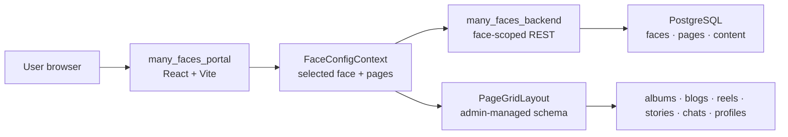
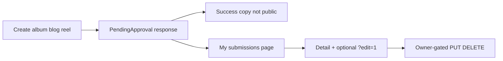
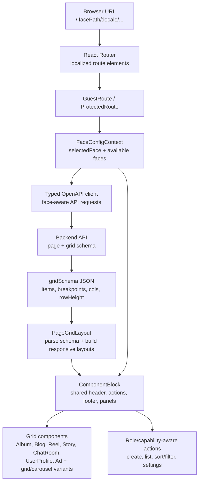
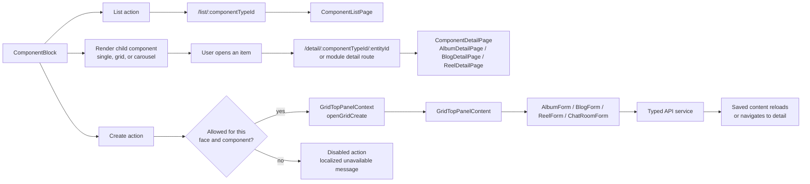

# Many Faces AI (MFAI) - frontend application

**Version:** [`0.9.0`](./VERSION) · [Changelog](./CHANGELOG.md)

**Author:** Ladislav Kostolny · [01laky@gmail.com](mailto:01laky@gmail.com)

**User-facing web experience for Many Faces AI.** This React app renders face-scoped social spaces: dynamic page grids, localized routes, auth flows, content modules, stories, chat rooms, profiles, submissions, and role-aware actions backed by the API. Layout and modules come from admin-managed **`gridSchema`** JSON per face — not hard-coded routes. Users never talk to workers or AI directly.

### Three pillars

| Pillar               | Highlights                                                                                                                                                                                                                                                                                                    |
| -------------------- | ------------------------------------------------------------------------------------------------------------------------------------------------------------------------------------------------------------------------------------------------------------------------------------------------------------- |
| **Security (PSH1)**  | OAuth tokens in `localStorage`; single-flight refresh; production **`validateEnv()`** (HTTPS API, no demo OAuth secret); face-scoped routing; blog HTML sanitization; SignalR JWT via `accessTokenFactory`. CI: `node ../scripts/verify-portal-security-tests.mjs`. [`docs/SECURITY.md`](./docs/SECURITY.md). |
| **AI (user-facing)** | **AI-assisted content approval** — create album/blog/reel → **My submissions** shows moderation status (no raw model output). Backend runs `ReviewContent`; portal shows creator-safe copy only. [`../docs/guides/ai-assisted-content-approval.md`](../docs/guides/ai-assisted-content-approval.md).          |
| **Configuration**    | **`GET /api/faces/config`** drives navigation, gradients, and page list; **face URL prefix** scopes all API calls; **capabilities** from `/api/me/capabilities` gate UI actions; i18n routes (en/sk/cs). Grid blocks: albums, blogs, reels, stories, chat, profiles, wall tickets.                            |

| Start here                  | Link                                                                                                                                                              |
| --------------------------- | ----------------------------------------------------------------------------------------------------------------------------------------------------------------- |
| **Security (PSH1)**         | [`docs/SECURITY.md`](./docs/SECURITY.md) — tokens, env validation, XSS/URL, SignalR, CI gate                                                                      |
| Run in full stack           | `../scripts/start-all-dev.sh` from `many_faces_main`                                                                                                              |
| Local app                   | `http://localhost:9080` / `https://localhost:9081` via portal proxy                                                                                               |
| Global ADMIN vs SUPER_ADMIN | Portal for **`ADMIN`**; admin app requires **`SUPER_ADMIN`** — [`../docs/guides/admin-superadmin-only-access.md`](../docs/guides/admin-superadmin-only-access.md) |
| Performance / Query         | [`docs/performance-and-query-appendix.md`](./docs/performance-and-query-appendix.md)                                                                              |
| Content approval UX         | [`../docs/guides/ai-assisted-content-approval.md`](../docs/guides/ai-assisted-content-approval.md)                                                                |
| Static i18n                 | [`../docs/guides/static-localization-and-i18n.md`](../docs/guides/static-localization-and-i18n.md)                                                                |

### Security at a glance (PSH1)

- OAuth tokens in `localStorage`; single-flight refresh on 401; logout clears auth + capabilities cache.
- Production builds: **`validateEnv()`** requires HTTPS `VITE_API_URL` and rejects demo OAuth secret (PSH1-E02).
- Face-scoped API routing; safe redirect and blog HTML sanitization; SignalR JWT via `accessTokenFactory`.
- Security Vitest: **`yarn test:security`**; monorepo CI: **`node scripts/verify-portal-security-tests.mjs`**.
- Cypress on production bundle: set non-demo **`VITE_OAUTH2_CLIENT_SECRET`** at build (CI does this automatically).



## Overview

The MFAI frontend is the user-facing React application for Many Faces AI. It is responsible for rendering configurable face pages, localized navigation, authenticated social experiences, dynamic page grids, media-rich content blocks, profiles, chats, stories, albums, blogs, reels, wall listings, and role-aware user flows on top of the backend API.

The application is built around the concept of **faces**: configurable community spaces with their own route prefix, visual context, page structure, available modules, content, and access rules. A face can represent a public community, private group, branded space, or specialized social environment. The frontend resolves the active face from the URL and shared face configuration, then uses that context to load the correct page layout, scope API requests, render the right components, and expose only the actions available to the current user.

At the UI level, the app combines an admin-managed grid system with reusable social building blocks. Pages are not treated as one-off hardcoded screens: the backend can provide layout schemas, and the frontend turns those schemas into responsive blocks such as albums, blogs, reels, chat rooms, story rings, profile cards, wall ticket listings, and other social modules. This makes the frontend suitable for experimenting with different community experiences without rewriting the whole page structure each time.

The frontend also acts as the main interaction layer for authenticated users. It handles login and registration flows, protected routes, JWT-backed API calls, selected face context, localized route handling, content creation entry points, responsive navigation, and user-facing feedback such as loading states, empty states, and disabled unavailable actions. It is designed to keep the user experience clear even when a face has different permissions, modules, or available content than another one.

Security and trust boundaries are visible in the frontend design. Authentication state, protected route guards, role-aware controls, capability-aware actions, face-aware data loading, and explicit unsupported states help users understand what they can and cannot do in the current context. Enforcement remains the responsibility of the backend, but the frontend mirrors those rules intentionally so sensitive or unavailable actions are not presented as normal user options.

From an engineering perspective, this submodule is also a playground for a modern React architecture: generated OpenAPI clients, TypeScript models, React contexts, TanStack Query data loading, i18n route support, reusable component blocks, responsive grid rendering, Docker-based local development, linting, type checks, unit tests, and Cypress smoke coverage are all part of the application. The goal is to keep the frontend understandable, testable, and easy to extend as new face modules and social workflows are added.

## What This Frontend Shows

- Face-aware routing based on URL prefixes and shared face configuration.
- Dynamic page grids rendered from backend-managed layout schemas.
- Reusable grid blocks for social content, media, messaging, profiles, and listings.
- User-facing modules for albums, blogs, reels, stories, wall tickets, chat rooms, profiles, follows, blocks, comments, likes, and notifications.
- Authenticated and unauthenticated flows with protected routes and JWT-backed API calls.
- Role/capability-aware UI behaviour for create flows, admin-dependent actions, and unavailable features.
- Localized routes and UI strings for English, Slovak, and Czech.
- Responsive rendering for grid layouts, cards, carousels, pagination, and mobile-friendly views.
- Generated OpenAPI API client with typed services and models.
- React contexts for auth, face configuration, grid top panel state, and shared application state.
- Neutral local placeholders and explicit empty states instead of relying on external placeholder services.
- Submitted-for-approval feedback for user-created albums, blogs, and reels, plus a **My submissions** hub (`/my-submissions`) backed by `GET /api/my/content-submissions`, so users see queue state, safe reasons, and deep links to detail with optional `?edit=1` when edits are allowed.
- Docker-first local development that works both standalone and through the root monorepo scripts.
- Validation through ESLint, TypeScript checks, Vitest tests, and Cypress smoke coverage.

## User Content Approval UX

Albums, blogs, and reels created from the user-facing frontend follow the moderation workflow in [`docs/guides/ai-assisted-content-approval.md`](../docs/guides/ai-assisted-content-approval.md). Create flows use the existing OpenAPI services, read backend-owned `approvalStatus` / `aiReviewStatus` fields, and show **submitted-for-approval** copy after a successful create.

**My submissions** loads the unified moderation list, groups rows by pipeline state (pending, AI in progress, needs human review, terminal outcomes), and links to `/album/{id}`, `/blog/{id}`, or `/reel/{id}` (with `faceId` for reels when needed). **`?edit=1`** opens the editor when the backend allows owner edits (typically **pending** or **rejected**). Edit and delete controls on album/blog/reel detail pages are gated the same way.

Public grid/list/detail views stay **`Approved`-only** for other users; the UI never presents internal AI diagnostics (raw model reasons, trace IDs, flag dumps). Helpers in `src/utils/contentModeration.ts` map statuses to safe labels, trim creator-safe reasons, and back moderation badges — covered by Vitest.



## Route And Grid Rendering

The frontend turns a face URL and backend-managed page schema into a responsive grid of reusable social components:



## Component Interaction Flow

Grid blocks use the same wrapper and route contract, so list/detail/create behaviour stays consistent across content modules:



## Features

- **Modern React Stack**
  - React 18 with TypeScript
  - Vite for fast development and building
  - React Router for navigation
  - React Query for API data management

- **User Authentication**
  - User registration and login
  - Protected routes
  - JWT token management
  - OAuth2 flow support

- **Internationalization (i18n)**
  - **Static UI copy** — loaded at startup from `GET /api/localization/portal` (backend `.resx`; see monorepo guide)
  - **CMS page URL slugs** — per-page `routeTranslations` from faces config (PostgreSQL; edited in admin)
  - Languages: `en`, `sk`, `cz`; language switcher; localized app routes via `routes.*` and `src/utils/routeTranslations.ts`
  - **Full architecture (Mermaid):** [`docs/guides/static-localization-and-i18n.md`](../docs/guides/static-localization-and-i18n.md)

- **UI Components**
  - Custom Radix-based components (Button, Input, FormField)
  - Bootstrap styling
  - Toast notifications
  - Responsive design

- **API Integration**
  - Auto-generated API client from Swagger/OpenAPI
  - Type-safe API calls
  - Error handling and retry logic

- **Face Path Routing**
  - Automatic face prefix extraction from URL (e.g., `/acme-corp/dashboard`)
  - URL transformation: `/api/users` → `/api/acme-corp/users`
  - Language prefix handling: correctly identifies `/en/login` vs `/acme-corp/en/login`
  - Axios interceptors for automatic face path injection
  - Comprehensive test coverage (23 tests)

## Technologies

- **React 18** - UI library
- **TypeScript** - Type-safe JavaScript
- **Vite** - Build tool and dev server
- **React Router** - Client-side routing
- **React Query (TanStack Query)** - Server state management
- **Bootstrap** - CSS framework
- **Yarn** - Package manager (PnP mode)
- **Vitest** - Unit testing framework

## Project Structure

```
many_faces_portal/
├── src/
│   ├── api/                # Auto-generated API client
│   │   ├── services/       # API service classes
│   │   ├── models/         # TypeScript models
│   │   ├── core/           # API core utilities
│   │   ├── config.ts       # API client configuration with face path routing
│   │   ├── ApiClient.ts    # API client wrapper
│   │   └── __tests__/      # API tests (face path routing)
│   ├── components/         # React components
│   │   ├── radix/          # Custom UI components
│   │   └── ...             # Other components
│   ├── pages/              # Page components
│   ├── contexts/           # React contexts (Auth, App)
│   ├── hooks/              # Custom React hooks
│   ├── i18n/               # Internationalization
│   ├── styles/             # Global styles
│   ├── utils/              # Utility functions
│   └── main.tsx            # Application entry point
├── public/                 # Static assets
├── docker-compose.yml      # Docker Compose configuration
├── Dockerfile.dev          # Development Dockerfile
├── Dockerfile              # Production Dockerfile
├── scripts/                # Shell helpers (Docker dev: start/stop/clear/rebuild, lint, fix-editor)
└── README.md               # This file
```

## Running

### Running in Docker Container (Recommended)

The easiest way to run the frontend in development:

```bash
./scripts/start-dev.sh
```

This script will:

1. Check and install dependencies if needed
2. Run code validation (TypeScript, ESLint)
3. Format code with Prettier
4. Run unit tests
5. Start the Vite dev server in Docker
6. Make the app available at `http://localhost:8081`

**Monorepo full stack:** when you use **`many_faces_main`** `./scripts/start-all-dev.sh`, the browser entry is usually **`https://localhost:9081`** (or **`http://localhost:9080`**) via **fe-demo-proxy** — see [`docs/guides/dev-https.md`](../docs/guides/dev-https.md). Port **8081** is the Vite container port mapped for standalone submodule Docker or host `yarn dev`.

**Note**: The script runs tests before starting. If tests fail, the startup is stopped.

### Manual Docker Compose

```bash
docker-compose -f docker-compose.yml up --build
```

### Stopping Services

```bash
./scripts/stop-dev.sh
```

Or manually:

```bash
docker-compose -f docker-compose.yml down
```

### Clearing Everything

```bash
./scripts/clear-dev.sh
```

This removes containers, volumes, and images.

### Rebuilding Docker Images

To perform a clean rebuild of Docker images:

```bash
./scripts/rebuild-dev.sh
```

**Note**: This only builds images, it does NOT start containers. Use `./scripts/start-dev.sh` to start containers after rebuilding.

### Local Development (Without Docker)

1. **Install dependencies**:

   ```bash
   yarn install
   ```

2. **Start development server**:

   ```bash
   yarn dev
   ```

   The app will be available at `http://localhost:8081`

3. **Run tests**:

   ```bash
   yarn test
   ```

4. **Format code**:

   ```bash
   yarn format
   ```

5. **Build for production**:
   ```bash
   yarn build
   ```

## Configuration

### Environment Variables

The frontend uses environment variables (configured in `docker-compose.yml` or `.env`):

- `VITE_API_URL` - Backend API URL (default: `http://localhost:8000`)
- `VITE_API_HTTPS_URL` - Backend API HTTPS URL (default: `https://localhost:8001`)
- `VITE_APP_NAME` - Application name
- `VITE_APP_VERSION` - Application version
- `VITE_PORT` - Dev server port (default: `8081`)

### API Configuration

The API client is auto-generated from the backend Swagger/OpenAPI specification. To regenerate:

```bash
yarn generate:api
```

This updates the API client in `src/api/` based on the backend API schema.

## Pages

- **Home** (`/`) - Landing page with login/register links
- **Login** (`/login`) - User login page
- **Register** (`/register`) - User registration page
- **Protected Home** (`/:locale/home`) - Protected page after login

All pages support internationalization with localized routes:

- `/en/login` - English
- `/sk/login` - Slovak
- `/cz/login` - Czech

## Components

### Custom Components

- **Button** - Styled button component
- **Input** - Text input component
- **FormField** - Form field with label and validation
- **Header** - Application header with navigation
- **LanguageSwitcher** - Language selection dropdown
- **ProtectedRoute** - Route guard for authenticated users
- **GuestRoute** - Route guard for unauthenticated users

### API Integration

API client is generated from Swagger and provides type-safe methods:

```typescript
import { AuthService } from '@/api';

// Register
const result = await AuthService.register({
  email: 'user@example.com',
  password: 'password123',
  firstName: 'John',
  lastName: 'Doe',
});

// Login
const loginResult = await AuthService.login({
  email: 'user@example.com',
  password: 'password123',
});
```

## Face Path Routing

The frontend implements automatic face path routing. This allows the application to scope API requests to the active face based on the URL path.

### How It Works

When the application makes API requests, the axios interceptor (configured in `src/api/config.ts`) automatically:

1. **Extracts face path** from `window.location.pathname` (e.g., `/acme-corp/dashboard` → `acme-corp`)
2. **Handles language prefixes** correctly (e.g., `/en/login` → no face path, `/acme-corp/en/login` → `acme-corp`)
3. **Transforms API URLs** from `/api/users` to `/api/acme-corp/users`
4. **Adds face path** to all API requests automatically

### URL Examples

```
# Language-only route (no face path)
/en/login → API requests: /api/users (no face path added)

# Face-prefixed route
/acme-corp/dashboard → API requests: /api/acme-corp/users

# Face + language route
/acme-corp/en/login → API requests: /api/acme-corp/users
```

### Implementation Details

The face path routing is implemented via:

- **Axios Interceptors**: Global request interceptor in `src/api/config.ts`
- **Face Path Extraction**: Logic to identify face prefix vs language prefix
- **URL Transformation**: Automatic insertion of face path after `/api/` prefix
- **Language Support**: Correctly handles i18n routes with language prefixes

### Configuration

Face path routing is automatically configured when `configureApiClient()` is called in `main.tsx`:

```typescript
import { configureApiClient } from './api/config';

configureApiClient(); // Sets up face path routing automatically
```

### Testing

Face path routing has comprehensive test coverage (23 tests) in `src/api/__tests__/facePathRouting.test.ts`:

- Face path extraction from various URL formats
- URL transformation logic
- Language prefix handling
- Edge cases and error scenarios

Run tests:

```bash
yarn test
```

## Development Workflow

1. **Start backend**: Ensure backend API is running (via **many_faces_backend** / `many_faces_backend/` or monorepo `./scripts/start-all-dev.sh`)

2. **Start frontend**: Run `./scripts/start-dev.sh` or use monorepo `./scripts/start-all-dev.sh` to start all services

3. **Make code changes**: Edit code in `src/`

4. **Test changes**:
   - Unit tests: `yarn test`
   - Manual testing: Open `http://localhost:8081`

5. **View logs**: Check Docker logs or browser console

6. **Stop services**: Run `./scripts/stop-dev.sh` or monorepo `./scripts/stop-all-dev.sh`

## Testing

### Run Tests

```bash
yarn test
yarn test:security   # PSH1 Vitest *.security.test.ts subset
```

From monorepo root:

```bash
node scripts/verify-portal-security-tests.mjs
```

### Run Tests in Watch Mode

```bash
yarn test:watch
```

### Run Tests with Coverage

```bash
yarn test:coverage
```

### Cypress (E2E)

After a production build, `vite preview` serves **HTTP** on port **4173** (see `vite.config.ts` `preview`) so Cypress does not need dev certificates.

**Important:** The preview bundle runs with **`import.meta.env.PROD`**, so **`validateEnv()`** rejects the demo `VITE_OAUTH2_CLIENT_SECRET`. For local Cypress after `yarn build`, export a non-demo secret, e.g. `VITE_OAUTH2_CLIENT_SECRET=local-cypress-smoke-secret yarn build`. GitHub Actions sets `github-actions-ci-smoke-secret` on the build step.

```bash
yarn build
yarn preview --host 127.0.0.1 --port 4173 --strictPort   # background terminal
yarn test:e2e:ci                                       # app shell smoke
# Optional — requires API at E2E_API_URL (default http://127.0.0.1:8000):
yarn test:e2e:api
```

Tests are located in:

- `src/utils/__tests__/` - Utility function tests (route translations)
- `src/api/__tests__/` - API client tests (face path routing)
- Component tests (when added)

## Code Quality

### Linting

```bash
yarn lint
```

### Formatting

```bash
yarn format
```

### Type Checking

```bash
yarn type-check
```

### eslint-plugin-react-hooks (ESLint 10 peers)

Stable `eslint-plugin-react-hooks@latest` did not yet list ESLint **10** in `peerDependencies`, which caused Yarn **`YN0060`** / **`YN0086`** with ESLint 10 in this workspace. The project therefore pins an **exact** canary version whose peers include **`^10.0.0`** (see [facebook/react#35758](https://github.com/facebook/react/issues/35758)). **Removal trigger:** when `npm view eslint-plugin-react-hooks@latest peerDependencies` includes `^10.0.0` for `eslint`, switch `package.json` to that stable release and re-run `yarn install --immutable` plus `yarn validate` / `yarn test` / `yarn build`. **Automation:** bumps are **manual** here (no Dependabot ignore list ships in-repo).

## Build

### Development Build

```bash
yarn build
```

### Production Build

```bash
yarn build
```

Output will be in `dist/` directory, ready for deployment.

## Integration with Root Project

This frontend is part of the **`many_faces_main`** monorepo (`many_faces_portal/` submodule on GitHub: `many_faces_portal`) and integrates with:

- **Backend API**: **many_faces_backend** (`many_faces_backend/`, ASP.NET Core)
- **Database**: **many_faces_database** (`many_faces_database/`, PostgreSQL) — via backend
- **Redis**: **many_faces_redis** (`many_faces_redis/`) — job queue via backend
- **Admin**: **many_faces_admin** (`many_faces_admin/`, separate admin panel)

From the **many_faces_main** repository root, use the orchestration scripts to manage all services:

- `./scripts/start-all-dev.sh` - Start all services with live status screen
- `./scripts/stop-all-dev.sh` - Stop all services
- `./scripts/clear-all-dev.sh` - Clear all containers and volumes
- `./scripts/status-all.sh` - Show status of all services
- `./scripts/rebuild-all-dev.sh` - Rebuild all Docker images

## Troubleshooting

### Dependencies Not Installing

If Yarn PnP (Plug'n'Play) is causing issues:

```bash
# Check Yarn version
yarn --version

# Clear cache
yarn cache clean

# Reinstall
rm -rf .yarn/cache
yarn install
```

See `YARN_PNP.md` for more information.

### Port Already Allocated

If port 8081 is already in use:

```bash
# Find process using port
lsof -ti:8081

# Kill process
lsof -ti:8081 | xargs kill -9

# Or use clear script
./scripts/clear-dev.sh
```

### API Connection Failed

- Ensure backend API is running: `docker ps | grep be-demo-dev`
- Check API URL in environment variables
- Verify CORS is enabled on backend
- Check browser console for errors

### TypeScript Errors

- Ensure all dependencies are installed: `yarn install`
- Check TypeScript version: `yarn tsc --version`
- Try regenerating types: `yarn generate:api`

## Additional Documentation

- **Docker**: See `DOCKER.md` for Docker-specific documentation
- **Editor Setup**: See `SETUP_EDITOR.md` for IDE configuration
- **Yarn PnP**: See `YARN_PNP.md` for Yarn Plug'n'Play information
- **API Client**: See `src/api/README.md` for API client documentation
- **i18n**: [`docs/guides/static-localization-and-i18n.md`](../docs/guides/static-localization-and-i18n.md) (canonical) · `src/i18n/README.md` (code entrypoints)

## Central documentation (`many_faces_main`)

Inside the monorepo checkout, relative links such as [`../docs/guides/ai-assisted-content-approval.md`](../docs/guides/ai-assisted-content-approval.md) resolve to the shared `docs/` tree.

When viewing **only** this repository on GitHub, open the canonical monorepo paths instead:

- [Documentation hub](https://github.com/01laky/many_faces_main/blob/main/docs/README.md) (`docs/README.md`)
- [Static localization and i18n](https://github.com/01laky/many_faces_main/blob/main/docs/guides/static-localization-and-i18n.md)
- [AI-assisted content approval](https://github.com/01laky/many_faces_main/blob/main/docs/guides/ai-assisted-content-approval.md)
- [Git submodules workflow](https://github.com/01laky/many_faces_main/blob/main/docs/guides/git-submodules.md)
- [Development and CI](https://github.com/01laky/many_faces_main/blob/main/docs/guides/development.md) (`scripts/lint-all.sh`, `scripts/ci-local.sh`)
- [Mobile Expo client](https://github.com/01laky/many_faces_main/blob/main/docs/guides/mobile-expo-development.md) · [`many_faces_mobile` submodule](https://github.com/01laky/many_faces_mobile)
