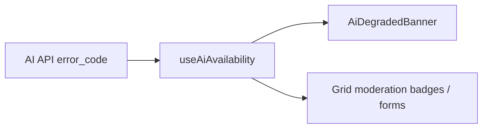

# AI degraded UX (portal)

Portal handling for AI worker availability contract (**AI-UP19**, **PT-RP30**).

## States

| State          | User-visible behaviour                                             |
| -------------- | ------------------------------------------------------------------ |
| `available`    | No banner; AI features enabled                                     |
| `loading`      | Banner: model warming (`model_loading`)                            |
| `unavailable`  | Banner: worker offline (`ollama_unavailable`, `generation_failed`) |
| `circuit_open` | Banner: circuit breaker (`ollama_circuit_open`)                    |
| `unknown`      | No banner until first AI error                                     |

Mapping lives in `src/hooks/useAiAvailability.ts` (`mapAiErrorCodeToState`).

## UI components

- **`AiDegradedBanner`** — global strip in `AppRoutes`; `retryProbe` clears TTL cache.
- **`reportAiError(err)`** — call from axios interceptors or mutation catch blocks when `error_code` present.

## Contract reference

See [`../../docs/guides/ai-availability-contract.md`](../../docs/guides/ai-availability-contract.md) for backend JSON shape.

## TTL

Degraded state auto-expires after **60s** so the UI recovers without full reload when the worker returns.
