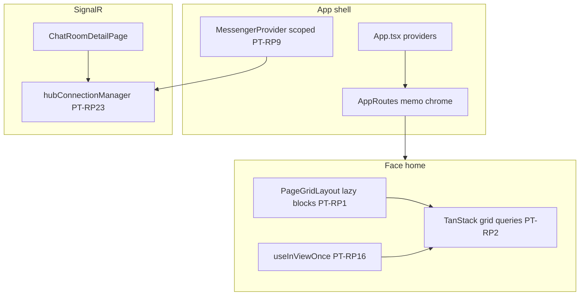
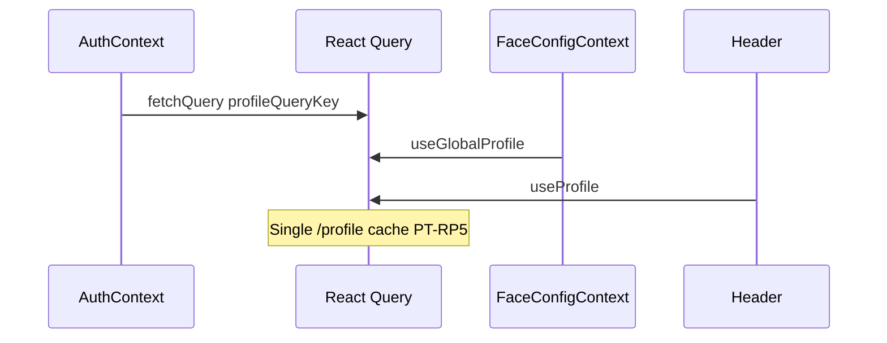

# Portal runtime performance v1

Engagement **PT-RP1…PT-RP30** for `many_faces_portal` — runtime cost reduction without framework change.

## Architecture (after v1)

## Data flow — profile bootstrap

## PT-RP index

| ID      | Theme                                             | Status in v1                        |
| ------- | ------------------------------------------------- | ----------------------------------- |
| PT-RP1  | Dynamic grid module loading (`gridBlockRegistry`) | Shipped                             |
| PT-RP2  | TanStack Query for grid lists                     | Shipped                             |
| PT-RP3  | Messenger incremental realtime merge              | Shipped                             |
| PT-RP4  | Settings tab lazy imports                         | Shipped (prior)                     |
| PT-RP5  | Profile bootstrap single Query source             | Shipped                             |
| PT-RP6  | ComponentDetailPage inner lazy split              | Shipped (prior)                     |
| PT-RP7  | ComponentBlock lazy forms                         | Partial / prior                     |
| PT-RP8  | Memoized grid cards                               | Shipped (Album/Blog)                |
| PT-RP9  | Scoped MessengerProvider                          | Shipped (badge always-on flag)      |
| PT-RP10 | Chat room parallel load                           | Shipped                             |
| PT-RP11 | AppRoutes Header/Footer memo                      | Shipped                             |
| PT-RP12 | Virtualized message lists                         | Shipped                             |
| PT-RP13 | Video lounge poll visibility gate                 | Shipped                             |
| PT-RP14 | Wall tickets Query dedup                          | Shipped                             |
| PT-RP15 | Auth state/actions split                          | Shipped                             |
| PT-RP16 | Intersection Observer grid fetch                  | Shipped                             |
| PT-RP17 | Bundle analyzer + baseline script                 | Shipped                             |
| PT-RP18 | Active-language i18n bootstrap                    | Shipped (prior)                     |
| PT-RP19 | Story slideshow timer hygiene                     | Shipped                             |
| PT-RP20 | Vitest face-home fetch budget                     | Shipped                             |
| PT-RP21 | Lazy face home shell                              | Partial / follow-up                 |
| PT-RP22 | FaceConfig Query cache                            | Shipped                             |
| PT-RP23 | Shared SignalR hub manager                        | Shipped                             |
| PT-RP24 | PageGridLayout render stability                   | Partial (PageGridItemShell)         |
| PT-RP25 | Route-intent prefetch                             | Shipped                             |
| PT-RP26 | Grid media loading hints                          | Shipped (GridMediaImage)            |
| PT-RP27 | Deferred ToastHost                                | Shipped (prior)                     |
| PT-RP28 | Capabilities write gates                          | Shipped (useCanCreateFromGridBlock) |
| PT-RP29 | Cypress face-home perf smoke                      | Shipped                             |
| PT-RP30 | AI degraded UX                                    | Shipped (AiDegradedBanner)          |

## Measurement

1. `cd many_faces_portal && yarn build:analyze` — `dist/stats.html` + chunk sizes.
2. `node scripts/portal-perf-baseline.mjs` — writes `dist/perf-baseline.json`.
3. Vitest: `src/__tests__/perf/faceHomeFetchBudget.test.ts`.
4. Cypress: `cypress/e2e/perf-face-home.cy.js`.

## Related docs

- [`performance-and-query-appendix.md`](./performance-and-query-appendix.md)
- [`ai-degraded-ux.md`](./ai-degraded-ux.md)
- [`../../docs/prompts/portal-runtime-performance-v1-agent-prompt.md`](../../docs/prompts/portal-runtime-performance-v1-agent-prompt.md)
