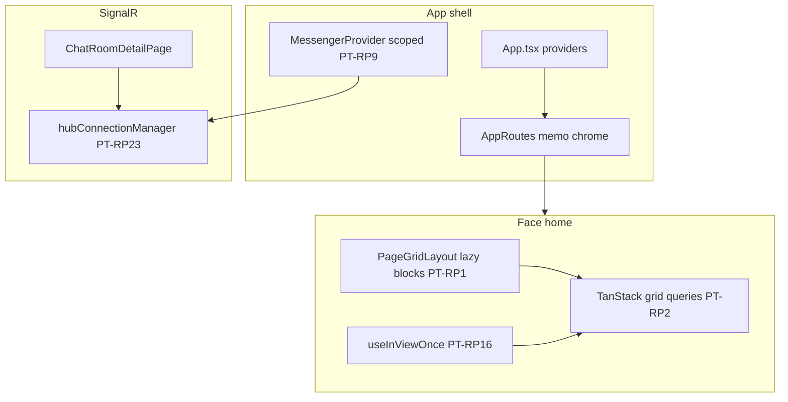
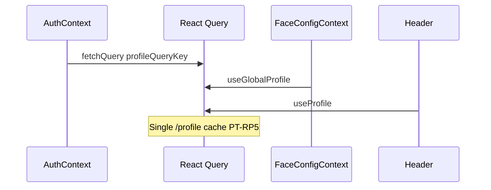

# Portal runtime performance v1

Engagement **PT-RP1…PT-RP30** for `many_faces_portal` — runtime cost reduction without framework change.

## Architecture (after v1)

```mermaid
flowchart TB
  subgraph shell [App shell]
    App[App.tsx providers]
    AR[AppRoutes memo chrome]
    MP[MessengerProvider scoped PT-RP9]
  end
  subgraph home [Face home]
    PGL[PageGridLayout lazy blocks PT-RP1]
    GQ[TanStack grid queries PT-RP2]
    IO[useInViewOnce PT-RP16]
    PGL --> GQ
    IO --> GQ
  end
  subgraph realtime [SignalR]
    HCM[hubConnectionManager PT-RP23]
    MP --> HCM
    CR[ChatRoomDetailPage] --> HCM
  end
  App --> AR --> home
```

## Data flow — profile bootstrap

```mermaid
sequenceDiagram
  participant Auth as AuthContext
  participant Q as React Query
  participant FC as FaceConfigContext
  participant H as Header
  Auth->>Q: fetchQuery profileQueryKey
  FC->>Q: useGlobalProfile
  H->>Q: useProfile
  Note over Q: Single /profile cache PT-RP5
```

## PT-RP index

| ID      | Theme                                             | Status in v1                        |
| ------- | ------------------------------------------------- | ----------------------------------- |
| PT-RP1  | Dynamic grid module loading (`gridBlockRegistry`) | Shipped                             |
| PT-RP2  | TanStack Query for grid lists                     | Shipped                             |
| PT-RP3  | Messenger incremental realtime merge              | Shipped                             |
| PT-RP4  | Settings tab lazy imports                         | Shipped (prior)                     |
| PT-RP5  | Profile bootstrap single Query source             | Shipped                             |
| PT-RP6  | ComponentDetailPage inner lazy split              | Shipped (prior)                     |
| PT-RP7  | ComponentBlock lazy forms                         | Partial / prior                     |
| PT-RP8  | Memoized grid cards                               | Shipped (Album/Blog)                |
| PT-RP9  | Scoped MessengerProvider                          | Shipped (badge always-on flag)      |
| PT-RP10 | Chat room parallel load                           | Shipped                             |
| PT-RP11 | AppRoutes Header/Footer memo                      | Shipped                             |
| PT-RP12 | Virtualized message lists                         | Shipped                             |
| PT-RP13 | Video lounge poll visibility gate                 | Shipped                             |
| PT-RP14 | Wall tickets Query dedup                          | Shipped                             |
| PT-RP15 | Auth state/actions split                          | Shipped                             |
| PT-RP16 | Intersection Observer grid fetch                  | Shipped                             |
| PT-RP17 | Bundle analyzer + baseline script                 | Shipped                             |
| PT-RP18 | Active-language i18n bootstrap                    | Shipped (prior)                     |
| PT-RP19 | Story slideshow timer hygiene                     | Shipped                             |
| PT-RP20 | Vitest face-home fetch budget                     | Shipped                             |
| PT-RP21 | Lazy face home shell                              | Partial / follow-up                 |
| PT-RP22 | FaceConfig Query cache                            | Shipped                             |
| PT-RP23 | Shared SignalR hub manager                        | Shipped                             |
| PT-RP24 | PageGridLayout render stability                   | Partial (PageGridItemShell)         |
| PT-RP25 | Route-intent prefetch                             | Shipped                             |
| PT-RP26 | Grid media loading hints                          | Shipped (GridMediaImage)            |
| PT-RP27 | Deferred ToastHost                                | Shipped (prior)                     |
| PT-RP28 | Capabilities write gates                          | Shipped (useCanCreateFromGridBlock) |
| PT-RP29 | Cypress face-home perf smoke                      | Shipped                             |
| PT-RP30 | AI degraded UX                                    | Shipped (AiDegradedBanner)          |

## Measurement

1. `cd many_faces_portal && yarn build:analyze` — `dist/stats.html` + chunk sizes.
2. `node scripts/portal-perf-baseline.mjs` — writes `dist/perf-baseline.json`.
3. Vitest: `src/__tests__/perf/faceHomeFetchBudget.test.ts`.
4. Cypress: `cypress/e2e/perf-face-home.cy.js`.

## Measured baseline (2026-07-25)

First recorded PT-RP17 baseline. Environment: **local build** on macOS (darwin), Node
**v20.18.3** (Vite 8.1.5 warns it wants 20.19+/22.12+ but builds fine), Yarn 4.12.0,
`yarn build` + `node scripts/portal-perf-baseline.mjs` (raw + gzip via `zlib.gzipSync`,
sizes below in KiB). Chunk hashes are per-build; compare by chunk name.

**Totals** (`dist/perf-baseline.json`, `generatedAt 2026-07-25T18:37:19.899Z`):

| Metric     | Count | Raw KiB | Gzip KiB |
| ---------- | ----- | ------- | -------- |
| All assets | 149   | 1593.0  | 473.8    |
| JS chunks  | 95    | 1345.1  | 418.5    |
| CSS chunks | 54    | 247.9   | 55.3     |

**Top chunks by gzip size** (from the same `perf-baseline.json`):

| Chunk                         | Raw KiB | Gzip KiB |
| ----------------------------- | ------- | -------- |
| `vendor-SuVN_ZDk.js`          | 338.3   | 93.4     |
| `vendor-react-dom-….js`       | 170.7   | 53.2     |
| `vendor-quill-….js`           | 134.4   | 38.2     |
| `index-….js` (entry)          | 89.6    | 24.2     |
| `vendor-forms-….js`           | 61.1    | 20.0     |
| `index-….css` (global styles) | 115.3   | 17.7     |
| `vendor-axios-….js`           | 43.7    | 16.5     |
| `vendor-grid-layout-….js`     | 52.7    | 15.6     |
| `vendor-i18n-….js`            | 46.0    | 14.8     |
| `vendor-router-….js`          | 41.3    | 14.6     |
| `vendor-signalr-….js`         | 53.6    | 13.6     |
| `vendor-radix-….js`           | 39.8    | 12.4     |

Notes from this run:

- `yarn build:analyze` now really produces `dist/stats.html` (1.3 MB treemap) — the
  script previously set `ANALYZE=true` on the `tsc -b` step only, so the visualizer
  plugin never activated; fixed in `package.json`.
- Build warning to keep an eye on: `HomePage` is both statically imported
  (`GuestRedirects.tsx`) and lazily imported (`lazyPages.tsx`), so its dynamic import
  cannot split a chunk (`INEFFECTIVE_DYNAMIC_IMPORT`).
- Grid blocks stay small: every grid Grid/Carousel/single-tile chunk is ≤ 4.8 KiB raw
  (≤ 2.1 KiB gzip).

## Related docs

- [`performance-and-query-appendix.md`](./performance-and-query-appendix.md)
- [`ai-degraded-ux.md`](./ai-degraded-ux.md)
- [`../../docs/prompts/portal-runtime-performance-v1-agent-prompt.md`](../../docs/prompts/portal-runtime-performance-v1-agent-prompt.md)
